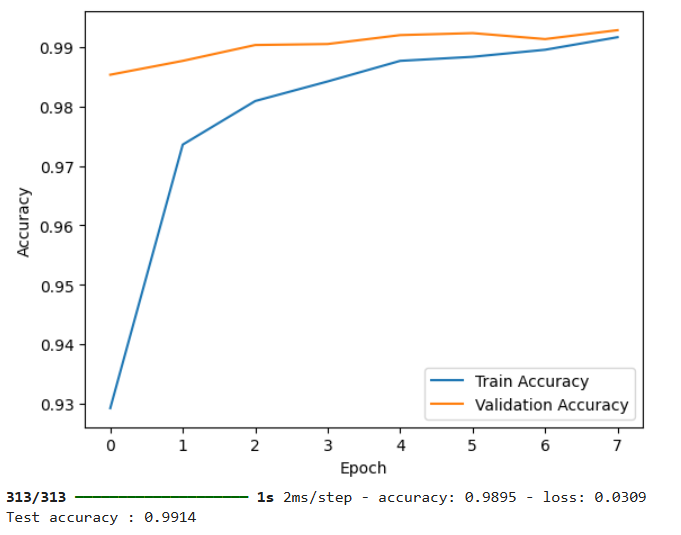

## 🖥️Digit Recognition using Tensorflow

This project implements a **Convolutional Neural Network (CNN)** in TensorFlow/Keras to classify handwritten digits (0–9) from the **MNIST dataset**.  
The model is trained with **callbacks** for better optimization and overfitting prevention, and the results are visualized with accuracy plots.

---

## 📊 Dataset
- **Source**: [MNIST Handwritten Digit Dataset](http://yann.lecun.com/exdb/mnist/)
- **Size**: 60,000 training images, 10,000 test images
- **Image Size**: 28×28 pixels, grayscale

---

## ⚙️ Model Architecture
1. **Conv2D (32 filters, 3×3, ReLU)**  
2. **MaxPooling2D (2×2)**  
3. **Conv2D (64 filters, 3×3, ReLU)**  
4. **MaxPooling2D (2×2)**  
5. **Flatten Layer**  
6. **Dense (128 neurons, ReLU)**  
7. **Dropout (0.5)**  
8. **Dense (10 neurons, Softmax)**  

---

## 🚀 Training Details
- **Optimizer**: Adam  
- **Loss Function**: Categorical Crossentropy  
- **Batch Size**: 32  
- **Epochs**: 8 (with Early Stopping to stop overfitting and save best model)  
- **Validation Split**: 10%  

---

## 📌 Callbacks Used
- **ModelCheckpoint** → Saves the best model based on validation accuracy.  
- **EarlyStopping** → Stops training if validation loss doesn't improve for 3 consecutive epochs.  

---

## 📈 Results

**Training vs Validation Accuracy**

**Final Test Accuracy:** ~99.14% ✅

